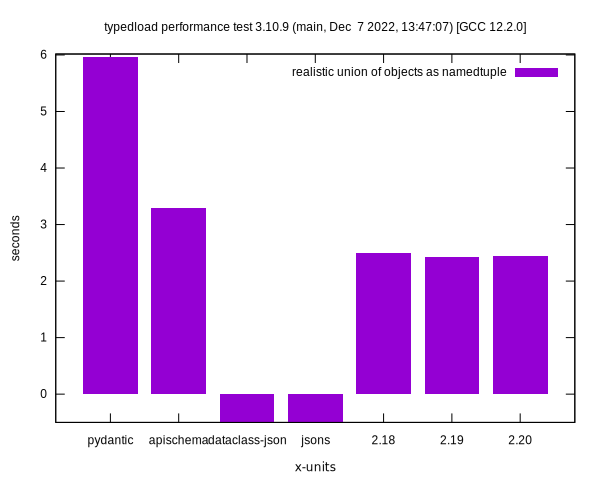
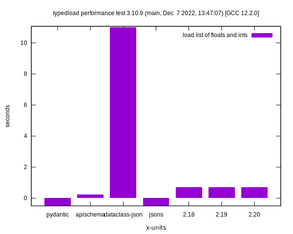

Performance
===========

The tests are done on my PC.

`typedload` manages to win quite a few benchmarks despite the competitors are compiled to binary `.so` files. Probably compiling it would make it win hands down. Feel free to help!

Negative values mean that the library could not do the test or returned incorrect values.

Keep in mind that when `jsons` and `dataclasses-json` are outperforming the rest, it usually means they are just passing the data without doing any check for correctness of the types.

Using Python 3.10
-----------------

It is possible to see that it is always faster than `pydantic`, and is faster than `apischema` in just one test. `jsons` and `dataclasses-json` are usually very slow, unless they just return the same data without checking anything.





Using Python 3.11
-----------------

It is possible to see that it is always faster than `pydantic`. `apischema` doesn't work with Python 3.11 so all results are -1. `jsons` and `dataclasses-json` are usually very slow, unless they just return the same data without checking anything.

With Python 3.11 some tests are faster but some other are slower. So it seems that in this use case the performance improvements are a bit hit or miss.


Run the tests
-------------

Generate the performance chart locally.

```bash
python3 -m venv perfvenv
. perfvenv/bin/activate
pip install apischema pydantic attrs dataclasses-json jsons
export PYTHONPATH=$(pwd)
make gnuplot
```
