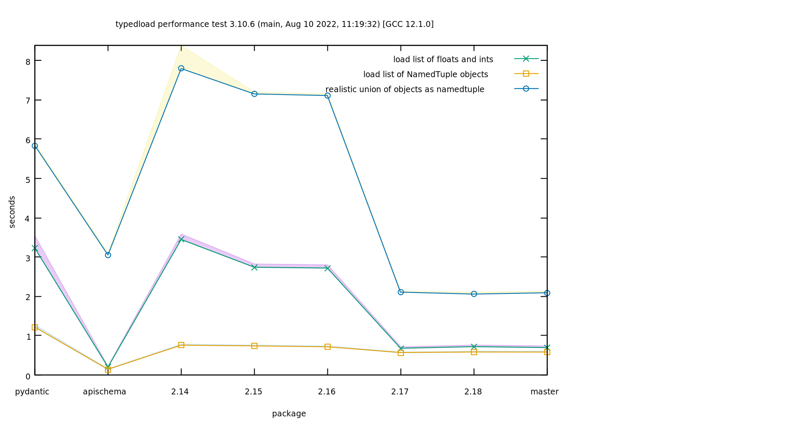
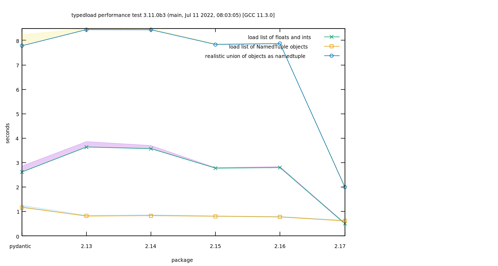

Performance
===========

The tests are done on my PC.

`typedload` manages to win some benchmarks despite the competitors are compiled to binary `.so` files. Probably compiling it would make it win hands down. Feel free to help!

Using Python 3.10
-----------------



It is possible to see that the latest version is always faster than `pydantic`, and can be slower or faster than `apischema` depending on the test.

Using Python 3.11
-----------------



It is possible to see that the latest version is always faster than `pydantic`. There is no `apischema` because it doesn't run with Python 3.11.


Run the tests
-------------

Generate the performance chart locally.

```bash
python3 -m venv perfvenv
. perfvenv/bin/activate
pip install apischema pydantic attrs
export PYTHONPATH=$(pwd)
make gnuplot
```
