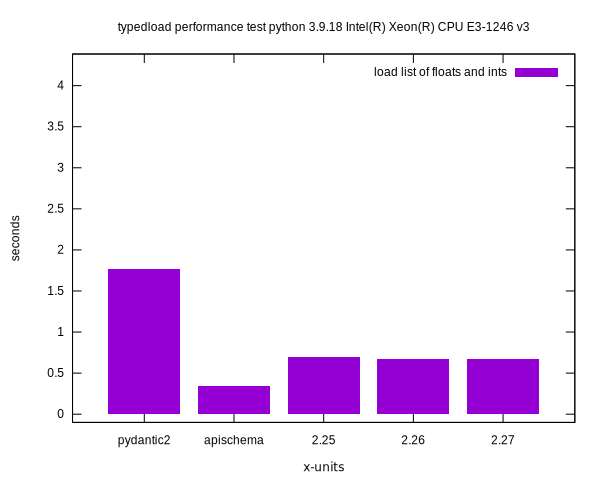
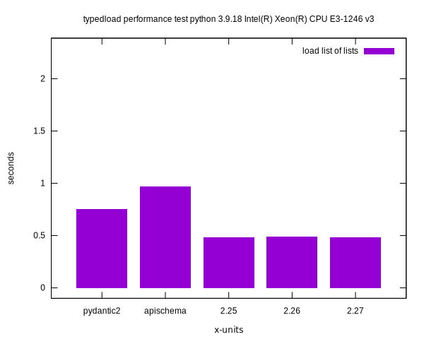
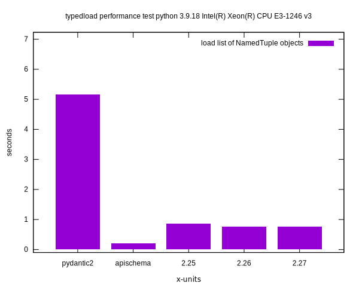
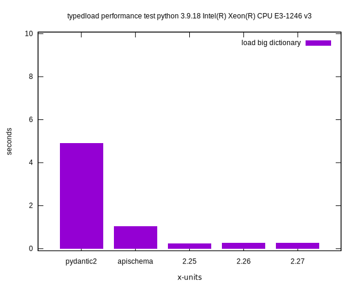
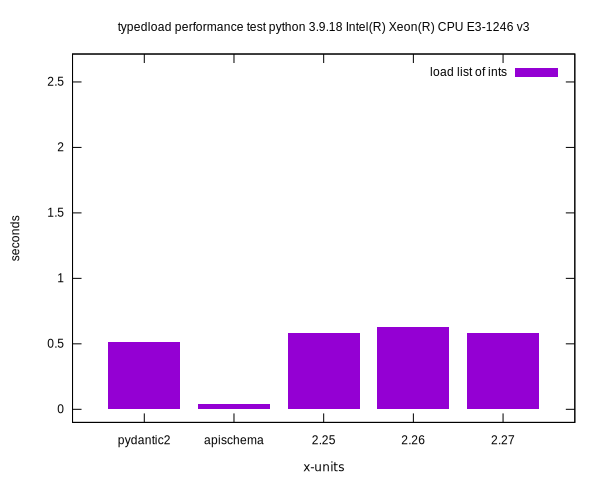
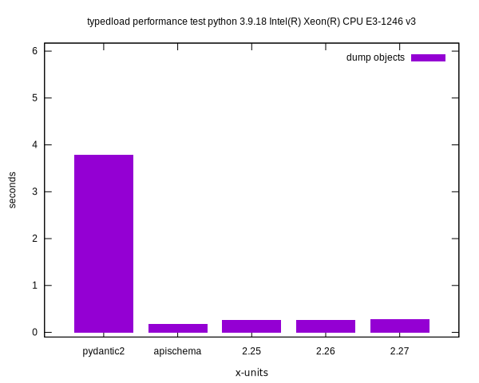
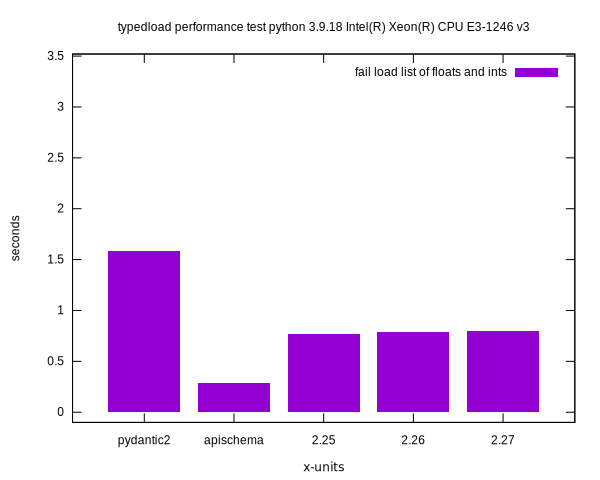

[THE PROJECT MIGRATED TO CODEBERG](https://ltworf.codeberg.page/typedload/)

Performance
===========

Negative values mean that the library could not do the test or returned incorrect values.

The tests are done on my PC. The following libraries are tested:

* `typedload`, the 3 most recent versions
* `pydantic2` years of work to rewrite it in Rust, still managing to lose some benchmarks 😅
* `apischema` is slower for nested data and faster otherwise

Using Python 3.11
-----------------


Using Pypy 7.3.12
-----------------











Run the tests
-------------

Generate the performance chart locally.

```bash
python3 -m venv perfvenv
. perfvenv/bin/activate
pip install apischema pydantic attrs
export PYTHONPATH=$(pwd)
make gnuplot
```
